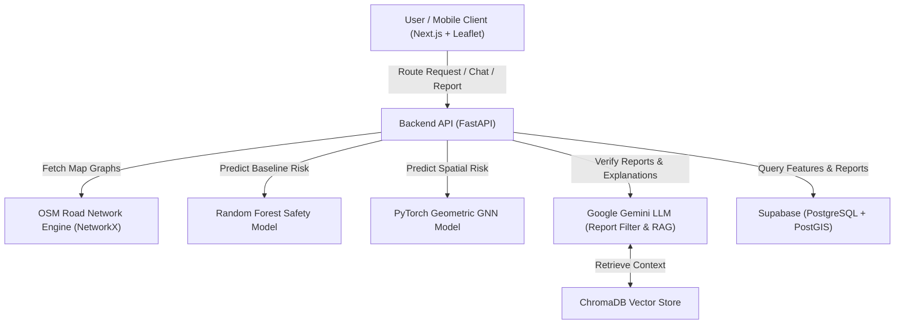

# SafePath AI Architecture Document

## System Architecture

## Core Subsystems
1. **Routing Subsystem**: Integrates OpenStreetMap data for Mumbai/Pune region to generate candidate walking routes.
2. **Safety Scoring Engine**: Features street lighting, CCTV density, crowd levels, and historical crime reports.
3. **Spatial Risk Modeling**: GNN propagates risk across adjacent road segments.
4. **Report Trust Filter**: Gemini scores user reports (0.0 to 1.0 credibility) before DB insertion.
5. **RAG Copilot**: Embeds local safety advice and route data to provide explainable safety insights.

